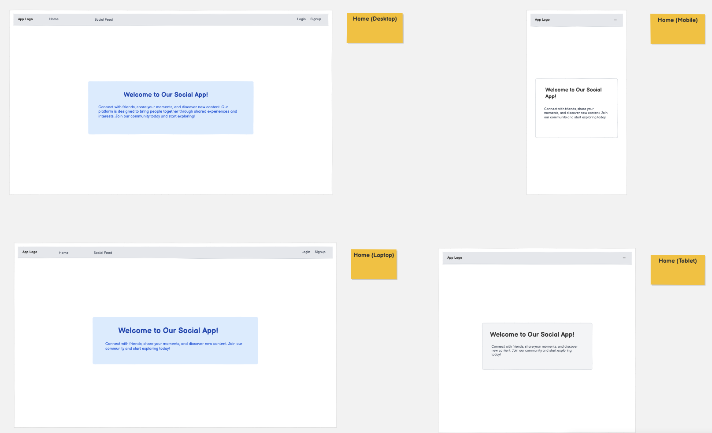
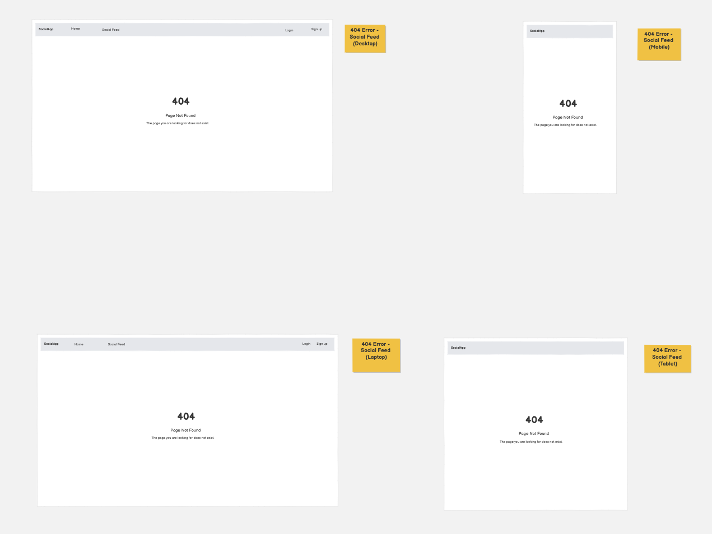
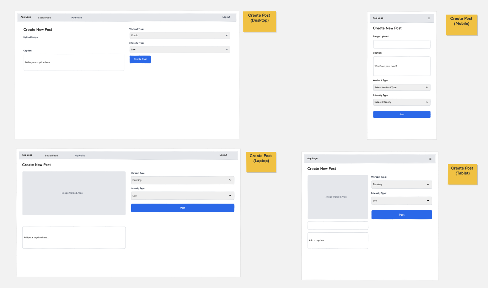
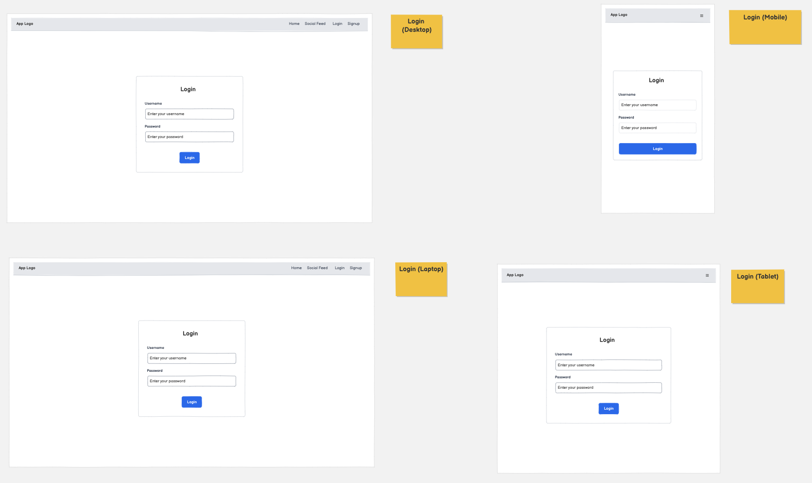
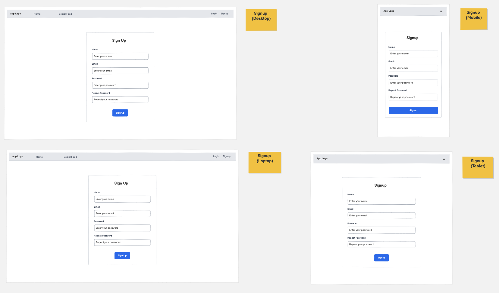
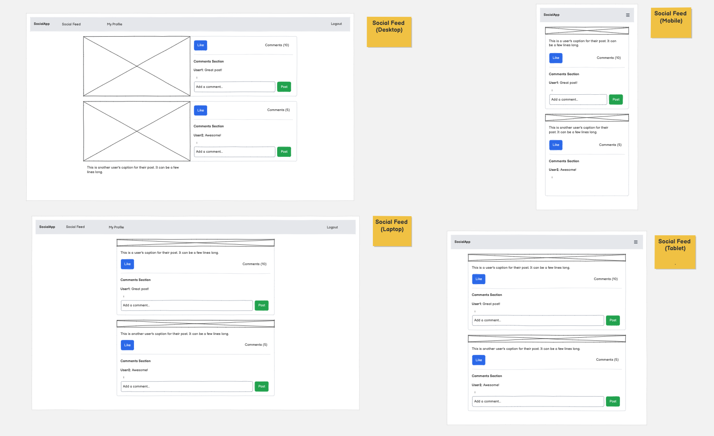

# project3-social-fitness(https://github.com/Louiseskinner01/project3-social-fitness)

Developer: Louise Skinner ([Louiseskinner01](https://www.github.com/Louiseskinner01))

## Social Fitness
Social Fitness is a community-driven web application designed to motivate users through social interaction and workout tracking. The platform allows users to create an account, share workout posts with images, specify workout type and intensity, and engage with other users through likes and comments.

The application focuses on simplicity, accessibility, and accountability, providing a space where users can document their fitness journey, interact with a supportive community, and manage their own content through personalised profiles.

**Site Mockups**

source: [project3-social-fitness amiresponsive](https://ui.dev/amiresponsive?url=https://louiseskinner01.github.io/project3-social-fitness)

### The 5 Planes of UX
#### 1. Strategy

**Purpose**
- Provide users with a clean and simple web application where they can engage and socialise with others users on their fitness journey.
- Deliver a tool where users can upload and delete images, create and edit comments and like an unlike posts.
- Support accessibility through clear design, responsive layouts, and intuitive controls.

**Primary User Needs**
- Create POSTS which can be visible to other users via a main social feed page.
- Track a personal fitness journey and engage with others to feel motivated and inspired.
- Enjoy a social-media like experience specifically for individuals on a fitness journey.

**Site Owner Goals**
- Provide a simple and accessible social fitness platform.
- Encourage community engagement.
- Enable content management and moderation.
-Demonstrate full-stack development capability.
#### 2. Scope

**[Features](#features)** (see below)
- User registration and authentication.
- Create, edit and delete posts.
- Upload workout images.
- Add workout type and intensity.
- Like/unlike posts.
- View personal profile.
- Responsive navigation.

**Content Requirements**
- Comments and likes
- User-generate workout posts
- Profile-specific content
- Static informational pages (landing (home) & index(social feed)

#### 3. Structure

**Information Architecture**
- **Navigation Menu**:
   - Navigation Menu: A dynamic nav bar that displays different nav links depending on whether the user is logged in or not. If the user is not logged in/signed up they will see the following links: Home, Social Feed, Login and Signup. If the user is logged in they will see: Social Feed, My Profile and Logout (NOTE: if the user is on My Profile they will also see a nav link called Create Post)

**User Flow**
  - Landing page accessible to all users.
  - Authentication redirects users to the social feed.
  - Profile page allows users to manage their own content.
  - Posts display chronologically.
  - Comments nested beneath posts. 
  - Conditional navigation links based on login state

#### 4. Skeleton

**[Wireframes](#wireframes)** (see below)

#### 5. Surface

**Visual Design Elements**
- **[Colours](#colour-scheme)** (see below)
- **[Typography](#typography)** (see below)

### Colour Scheme

The visual design of Social Fitness follows a minimal and content-focused approach. The design philosophy aligns with modern social platforms where simplicity and clarity enhance user engagement whilst adopting a cleaner and more neutral style to support usability and readability.

Bootstrap’s default styling and component library were intentionally used to ensure visual consistency, accessibility, and responsive behaviour across devices. The design prioritises user-generated content—such as workout images and captions—rather than decorative elements, allowing posts to remain the primary focal point of the interface.
A restrained colour palette and standardised button styles were selected to reduce visual clutter, improve contrast, and maintain a professional appearance suitable for a social platform. This approach supports scalability, ensuring that additional features or user-customisation options can be integrated in future iterations without conflicting with an overly complex theme.

**Colour pallet** 
- Delete button (btn-danger)
- Like/unlike button ()
- Post button
- Login
- Logout

### Typography

## Wireframes

To follow best practice, wireframes were developed for mobile, tablet, and desktop sizes.
I've used [Balsamiq](https://balsamiq.com/wireframes) to design my site wireframes.

| Page | Mobile (landscape & portrait)  Tablet Desktop |
| --- | --- |
| Home|  |
| 404 Error |  |
| Create Post |  | 
| Login |  | 
| My Profile |  |
| Sign up |  | 
| Social Feed |  |

## User Stories
### General Play

| Target | Expectation | Outcome |
| --- | --- | --- |
| As a user | I would like to upload a image | so that I can populate my profile page with images of my workouts. |
| As a user | I want add a caption | so that my posts can be accompanied by a description. |
| As a user | I would like to add a workout type and an intensity level | to give more meaning to my workout post. |
| As a user | I would like to create an account | so I can use the social-fitness platform. |
| As a user | I would like to log in and out out of my account | so my profile is kept safe from non-authenticated users. |
| As a user | I would like to be able to delete my post | so I have full control of my user profile and what is and isnt displayed. |
| As a user | I would like like to view the main social feed | so I can be inspired by other users. |
| As a user |  I would like to like posts that other users have posted on the main social feed | so that I can share my interests. |
| As a user | I would like to comment on other users posts  | so that I can share my thoughts. |
|As a user | I want to be able to edit a comment I have made | so my comment can be corrected if I have made a mistake.|
|As a user | I want to access to to simple and clean navbar | so I can easily navigate through the web apps pages. |
| As a user | I would like to see a 404 error page if I get lost | so that it's obvious that I've stumbled upon a page that doesn't exist. |

### Accessibility & Usability

| Target | Expectation | Outcome |
| --- | --- | --- |
| As a visually impaired user | I want clear colour contrasts (e.g. bold backgrounds and bright highlights) | so that I can see buttons and numbers more clearly. |
| As a user with little computer skills | I want a simple web app | so I can fully utilise the apps features. |
| As a mobile user | I want large, tap-friendly buttons | so that I can use the app easily on my phone. |

### Content & Motivation 

| Target | Expectation | Outcome |
| --- | --- | --- |
| As a casual user | I want to be able to share my workouts | so that I can enjoy the web application without pressure. |
| As a competitive user (fitness influencer)| I want to sutilise the app | so that I can inspire other users who are new to fitness. |
| As a user new to fintess | I want to be able to access a community | so that I can learn and be inspired by fitness content. |

## Features
### Existing Features

| Feature | Notes | Screenshot |
| --- | --- | --- |
| User Registration | Users can create an account with username and password. Optional email field supported via custom form. |  |
| Login / Logout | Secure authentication with conditional navigation links based on login state.|  |
| User Profile | Dedicated profile page displaying user’s posts and comments. Access restricted to authenticated users. |  |
| Random Number Generation | Six numbers are generated at random (four small, two large). This ensures variety, so each game feels unique and unpredictable. |  |
| Create Post | Users can upload an image, add an optional caption, select workout type and intensity. |  |
| Delete Post | Users can delete only their own posts; ownership validation enforced.|  |
| Workout Type Field | Custom dropdown field allowing users to categorise workouts (Run, Yoga, Strength, etc.). |  |
| Workout Intensity Field | Optional intensity selection (Easy, Medium, Hard) to personalise workout entries. | [screenshot](documentation/features/undo-btn-used.png) |
| Social Feed | Displays all user posts chronologically with responsive image scaling. |  |
| Add Comment | Authenticated users can add comments beneath posts. |  |
| Edit Comment| Users can edit only their own comments with permission checks in place. |  |
| Like / Unlike Post| Heart-icon toggle button allowing one like per user per post with visual state change. |  |
| Like Constraint | Database-level uniqueness constraint prevents duplicate likes. |  |
| Responsive Navbar | Navigation adapts based on authentication state and screen size. |   |
| Custom 404 Page | User-friendly error page with conditional navigation options. |  |
| Conditional Navigation | “Create Post” link only visible when user is on profile page and authenticated. |  |
| Responsive Design | Bootstrap grid and fluid images ensure mobile-first compatibility. |  |
| Form Styling | Bootstrap form controls used for consistent UI across posts, comments, and authentication forms. |  |

### Future Features

**Profile Pictures / Avatars**: Allow users to upload a personal image to increase individuality and community recognition.

**User Bio / About Section**: Provide a short description field so users can share fitness goals or personal interests.

**Follow / Friend System**: Enable users to follow others and view a personalised activity feed.

**Reply to Comments**: Introduce threaded conversations to improve interaction and discussion depth.

**Notifications**: Alert users when their posts receive likes or comments to increase engagement.

**User Mentions (@username)**: Allow tagging other users within comments to encourage social interaction.

**Workout Statistics Fields**: Add optional inputs such as duration, distance, or calories burned to enrich workout data.

**Progress Tracking Dashboard**: Display charts or summaries of user activity over time for motivation and goal tracking.

**Workout Tags / Filters**: Allow filtering of posts by workout category (e.g., cardio, strength, flexibility).

**Dark Mode Toggle**: Provide a user-controlled theme switch for improved accessibility and personal preference.

**Email Verification**: Improve account security by requiring confirmation before activation.

**Password Reset Functionality**: Allow users to securely recover forgotten passwords without administrator assistance.

**Infinite Scroll / Advanced Pagination**: Improve performance and usability as the number of posts grows.

**Report Post Feature**: Enable users to flag inappropriate or harmful content for moderation.

**Admin Analytics Dashboard**: Provide administrators with insights into user activity and engagement trends.

## Tools & Technologies

| Tool / Tech | Use |
| --- | --- |
|  | Version control. (`git add`, `git commit`, `git push`) |
|  | Secure online code storage. |
|  | Local IDE for development. |
|  | Main site content and layout. |
|  | Design and layout. |
|  | Hosting the deployed front-end site. |
|  | Front-end CSS framework for modern responsiveness and pre-built components. |
|  | Automated ERD tool. |
|  | Creating wireframes. |
|  | Customisation of fonts. |
|  | Help debug, troubleshoot, and explain things. |
|  | Tutorials/Reference Guide |
|  | Guidance for implementing Django framework |

## Agile Development Process

### GitHub Projects

[GitHub Projects](https://www.github.com/Louiseskinner01/project2-the-countdown/projects) served as an Agile tool for this project. Through it, EPICs, User Stories, issues/bugs, and Milestone tasks were planned, then subsequently tracked on a regular basis using the Kanban project board.

| Stage   | Screenshot |
| ----- | --- |
| To Do |  |
| In-progress |   |
| Done |  |

### GitHub Issues

[GitHub Issues](https://www.github.com/Louiseskinner01/project3-social-fitness/issues) served as an another Agile tool. There, I managed my User Stories and Milestone tasks, and tracked any issues/bugs.

| Link | Screenshot |
| --- | --- |
|  |  |
|  |  |

### MoSCoW Prioritization

I've decomposed my Epics into User Stories for prioritizing and implementing them. Using this approach, I was able to apply "MoSCoW" prioritization and labels to my User Stories within the Issues tab.

- **Must Have**: guaranteed to be delivered - required to Pass the project (*max ~60% of stories*)

  - Must Have (Core to the project – without these the Social Fitness web based app won't be successful).
  - User Registration & Authentication: Users must be able to create an account, log in, and log out securely.
  - Create Post Functionality: Authenticated users must be able to upload an image and publish a workout post.
  - View Social Feed: All users must be able to view posts shared by the community.
  - User Profile Page: Users must be able to access a personal profile displaying their own posts.
  - Delete Own Posts: Ownership validation must prevent users from deleting others’ content.
  - Add Comments: Authenticated users must be able to comment on posts.
  - Edit Own Comments: Users must be able to modify only their own comments.
  - Like / Unlike Posts: Users must be able to engage with posts through a like system.
  - Database Integrity Constraints: Each user may only like a post once (unique like constraint).
  - Responsive Navigation: Navbar must adapt to authentication state and screen size.
  - Form Validation & Security: Prevent invalid submissions and unauthorised actions.
  - Custom Data Models: Posts must include workout type and intensity fields to demonstrate model customisation.

- **Should Have**: adds significant value, but not vital (*~20% of stories*)

  - Profile Customisation: Ability for users to upload a profile picture or short bio.
  - Comment Deletion: Allow users to remove their own comments in addition to editing.
  - Improved UI Styling: Enhanced visual polish beyond default Bootstrap components.
  - Post Sorting / Filtering: Ability to filter posts by workout type or date.
  - Password Reset Functionality: Self-service recovery for forgotten passwords.
  - Enhanced Error Pages: Custom 403 and 500 templates for a more consistent user experience.

- **Could Have**: has small impact if left out (*the rest ~20% of stories*)

  - Dark Mode Toggle: Optional theme switch for accessibility and user preference.
  - Animated Like Button: Micro-interaction animation for visual feedback.
  - Workout Statistics Tracking: Additional optional fields such as duration or calories burned.
  - User Notifications: Alerts for likes and comments.
  - Follow / Friend System: Personalised feeds based on followed users.
  - Threaded Comments / Replies: Nested discussions instead of flat comment lists.

- **Won't Have**: not a priority for this iteration - future features

  - Real-Time Messaging / Chat System: Requires WebSockets and advanced backend architecture.
  - Third-Party Fitness API Integration: Out of scope due to external dependency management.
  - Advanced Analytics Dashboards: Would significantly increase development complexity.
  - Mobile Native Application: The project is focused on a responsive web platform only.
  - Monetisation / Subscription Features: Not aligned with the educational objectives of the project.

## Testing

> [!NOTE]  
> For all testing, please refer to the [TESTING.md](TESTING.md) file.

## Deployment

### GitHub Pages

The site was deployed to GitHub Pages. The steps to deploy are as follows:

- In the [GitHub repository](https://www.github.com/Louiseskinner01/project3-social-fitness), navigate to the "Settings" tab.
- In Settings, click on the "Pages" link from the menu on the left.
- From the "Build and deployment" section, click the drop-down called "Branch", and select the main branch, then click "Save".
- The page will be automatically refreshed with a detailed message display to indicate the successful deployment.
- Allow up to 5 minutes for the site to fully deploy.

The live link can be found on [GitHub Pages](https://louiseskinner01.github.io/project3-social-fitness).

### Local Development

This project can be cloned or forked in order to make a local copy on your own system.

#### Cloning

You can clone the repository by following these steps:

1. Go to the [GitHub repository](https://www.github.com/Louiseskinner01/project3-social-fitness).
2. Locate and click on the green "Code" button at the very top, above the commits and files.
3. Select whether you prefer to clone using "HTTPS", "SSH", or "GitHub CLI", and click the "copy" button to copy the URL to your clipboard.
4. Open "Git Bash" or "Terminal".
5. Change the current working directory to the location where you want the cloned directory.
6. In your IDE Terminal, type the following command to clone the repository:
  - `git clone https://www.github.com/Louiseskinner01/project3-social-fitness.git`
7. Press "Enter" to create your local clone.

Alternatively, if using Gitpod, you can click below to create your own workspace using this repository.

**Please Note**: in order to directly open the project in Gitpod, you should have the browser extension installed. A tutorial on how to do that can be found [here](https://www.gitpod.io/docs/configure/user-settings/browser-extension).

#### Forking

By forking the GitHub Repository, you make a copy of the original repository on our GitHub account to view and/or make changes without affecting the original owner's repository. You can fork this repository by using the following steps:

1. Log in to GitHub and locate the [GitHub Repository](https://www.github.com/Louiseskinner01/project3-social-fitness).
2. At the top of the Repository, just below the "Settings" button on the menu, locate and click the "Fork" Button.
3. Once clicked, you should now have a copy of the original repository in your own GitHub account!

### Local VS Deployment

There are no remaining major differences between the local version when compared to the deployed version online.

## Credits
### Content

| Source | Notes |
| --- | --- |
| [Interactive Frontend Development](https://codeinstitute.net) | Code Institute walkthrough project inspiration |
| [w3schools](https://www.w3schools.com/) | Help with form validation, display:block/none vs visibiliy: visible/hidden |
| [Bootstrap](https://getbootstrap.com) | Various components / responsive front-end framework |
| [Django](https://django.com) | Various components such as forms, loops and reusable templates |
| [ChatGPT](https://chatgpt.com) | Help with code logic and explanations: **Example 1** **Example 2** **Example 3** 

### Media
- Image Compression
  - [TinyPNG](https://tinypng.com) (for images <5MB)
  - [CompressPNG](https://compresspng.com) (for images >5MB)
- Logo Maker
  - [Looka](https://looka.com/explore)

| Source | Notes |
| --- | --- |
| [favicon.io](https://favicon.io) | Generating the favicon |
| [TinyPNG](https://tinypng.com) | Compressing images < 5MB |
| [CompressPNG](https://compresspng.com) | Compressing images > 5MB |
| [GoogleFonts](https://fonts.google.com/) | Font styles throughout the site |

### Acknowledgements

- I would like to thank the [Code Institute](https://codeinstitute.net) Tutor Team for their assistance with troubleshooting and debugging some project issues.
- I would like to thank the [Code Institute Slack community](https://code-institute-room.slack.com) for the moral support; it kept me going during periods of self doubt and impostor syndrome.
- I would like to thank my little boy for giving me the drive and motivation to develop the right skills so I can be a successful web developer.

